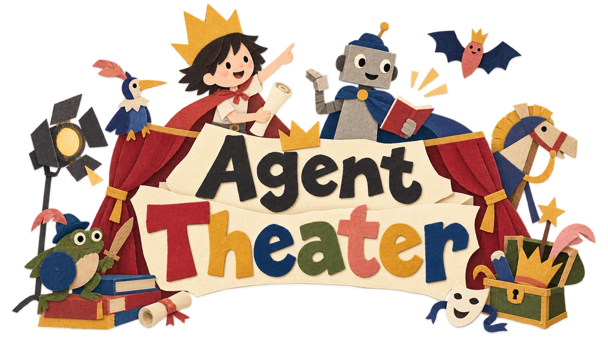
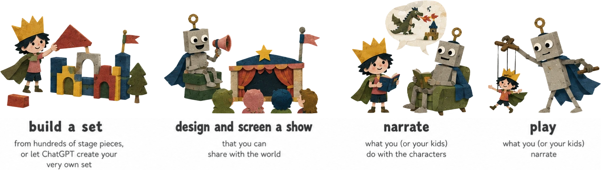
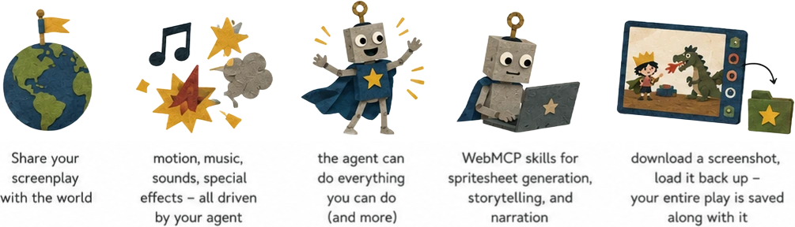
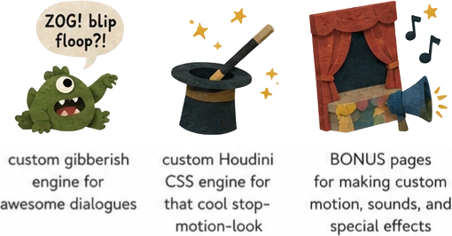

# Agent Theater

**Tell an AI agent a story. Watch it stage the play.**

Open the page and say *"put on a play about a wolf who is afraid of the dark"*. The agent chooses the cast, builds the set, writes the scenes, assigns voices, and runs the show.

You and the agent use the same stage. You can move characters and props yourself, ask the agent to take over, or edit the set while it works.

**[Open the theatre →](https://theater.needle.tools)** · [Devpost](https://devpost.com/software/agent-theater) · [Source](https://github.com/needle-tools/agent-theater)

## About

Agent Theater is an open-source paper theatre for making stories with an AI agent. People can build and perform by hand, narrate what should happen next, or ask the agent to create artwork, cast characters, arrange sets, write dialogue, direct motion, add music and effects, and screen the finished show.

WebMCP gives the agent typed access to the stage rather than relying on UI automation. The interface and the WebMCP tools update the same document, so the person and agent always see the same cast, set, scenes, and script.

Built by [Needle](https://needle.tools). Try it at [theater.needle.tools](https://theater.needle.tools), explore the [source](https://github.com/needle-tools/agent-theater), or read the [MIT License](LICENSE).

## Four ways to play

- Build a set from hundreds of stage pieces, or let ChatGPT create your very own set.
- Ask the agent to design and screen a show that you can share.
- Move the characters yourself while the agent narrates what happens.
- Narrate a story while the agent performs it with the characters.

## There's more

- Publish and share your screenplay.
- Motion, music, sounds and special effects — all driven by your agent.
- The agent has the same stage controls as you, plus tools for scripting and playback.
- And your **personal Codex pet** appears on the stage and directs it! 🪄
- WebMCP skills for spritesheet generation, storytelling and narration.
- Export a screenshot and load it later; the play data is stored inside the PNG.

## And there's even more

- A custom gibberish speech engine for character dialogue.
- A CSS Houdini paint worklet for the stop-motion look.
- Bonus workbenches for [recording custom motion](https://theater.needle.tools/record), [shaping voices](https://theater.needle.tools/talk) and [tuning the painterly renderer](https://theater.needle.tools/painted).

## Built for agents first

Agent Theater is a [WebMCP](https://github.com/webmachinelearning/webmcp) app. It registers typed tools directly in the page for adding and arranging pieces, creating scenes, casting characters, writing scripts, controlling sound and motion, and playing or publishing a show.

This is a good fit for WebMCP because a direction such as *"walk stage left, look surprised, then speak"* maps to structured stage actions. Both direct manipulation and tool calls change the same underlying document.

Nothing to install, no API key, no server. The tools are there when the page loads.

**Drive it from:**

| | |
| --- | --- |
| **ChatGPT** — the app and Atlas | Native WebMCP, no flag |
| **Codex** | Connects to the page's tools |
| **Microsoft Edge 147+** | Native |
| **Chrome 149+** | Origin trial — this app ships a token, so it just works |
| Firefox, Safari | Not yet |

## What is in the room

**Almost 600 pieces of art, in 21 packs.** The library includes animals, fairy-tale characters, heroes, villains, backdrops, and scenery for forests, deserts, oceans, streets, homes, and the night sky. Every piece has a name and description that the agent can search.

**A voice for every speaking character.** Voices are synthesised and adjusted per character. Actors receive profiles based on their artwork; other objects receive stable profiles generated from their names.

**218 sounds.** 38 music beds, 100 cues, 65 sound effects, and 15 transition seams.

**A paper stop-motion renderer.** A CSS paint worklet varies edges, texture, and ink over time while keeping the original artwork intact.

## How a play gets made

The tools cover the full production workflow:

| | |
| --- | --- |
| `theater_start` | The one to call first. It explains the rest. |
| `stage_create` | A scene, with its own music. |
| `stage_cast` | Who is in it, where they stand, how they arrive. |
| `stage_script` | The beats — *walk here, look surprised, say this, laugh*. |
| `show_play` | Runs it, and returns immediately with the timings so the agent can narrate on the beat. |
| `piece_*` | Add, cut out, arrange, restyle and trace anything on the canvas. |

Shows save, publish and share: `show_save`, `show_publish`, `show_list`, `show_load`. Share URLs are `/p/<id>`.

For custom artwork, `theater_art_prompt` creates an image-generation prompt in the project's paper-cut style, including the layout constraints needed for animation and spritesheet cutting.
