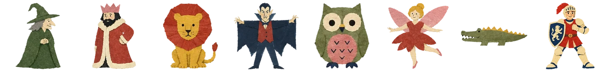

# Agent Theater

**Tell an AI agent a story. Watch it stage the play.**

Open the page and say *"put on a play about a wolf who is afraid of the dark"*. The agent casts the parts from a drawer of paper cut-outs, dresses the stage, writes the script beat by beat, gives every character a voice, and runs the show while narrating it aloud.

You are not watching a chatbot describe a play. The agent is working the actual stage — the same one you can drag pieces around on yourself, at the same time, while it does.

**[Open the theatre →](https://theater.needle.tools)** then ask your agent what it can do here.

## Built for agents first

Agent Theater is a [WebMCP](https://github.com/webmachinelearning/webmcp) app. The page hands the agent its own typed tools instead of making it hunt for buttons.

That is the whole difference. An agent automating a website normally works from the outside — read the DOM, find something that looks like a button, click it, hope. Staging a play that way is hopeless: *"walk stage left, look surprised, then speak"* is not a sequence of clicks. Here it is one call with a number in it.

Nothing to install, no API key, no server. The tools are there when the page loads.

**Drive it from:**

| | |
| --- | --- |
| **ChatGPT** — the app and Atlas | Native WebMCP, no flag |
| **Codex** | Connects to the page's tools |
| **Microsoft Edge 147+** | Native |
| **Chrome 149+** | Origin trial — this app ships a token, so it just works |
| Firefox, Safari | Not yet |

## What is in the room

**615 pieces of art, in 21 packs.** A cast of animals, fairy-tale characters, heroes and villains — and the scenery to put them in: forests, deserts, oceans, streets, kitchens, the night sky. Every piece is a paper cut-out with a name and a description, so an agent picks a mossy boulder on purpose rather than by luck.

**A voice for everyone who speaks.** Voices are synthesised and modulated per character — an actor sounds like its drawing suggests, and anything else gets a stable voice dealt from its own name. Nobody who was written a line goes unheard, and the same character sounds the same way every run.

**168 sounds.** 26 music beds that cross-fade between scenes, 71 stings that land on a beat, 56 effects, and 15 seams — curtain up, drumroll, curtain down.

**Paper that behaves like paper.** Every piece is drawn through a CSS paint worklet, so edges wander and the ink boils slightly, the way a hand-cut shape does. The cursor is cut from paper too.

## How a play gets made

Thirty-four tools, four families. An agent blocks a scene the way a director does:

| | |
| --- | --- |
| `theater_start` | The one to call first. It explains the rest. |
| `stage_create` | A scene, with its own music. |
| `stage_cast` | Who is in it, where they stand, how they arrive. |
| `stage_script` | The beats — *walk here, look surprised, say this, laugh*. |
| `show_play` | Runs it, and returns immediately with the timings so the agent can narrate on the beat. |
| `piece_*` | Add, cut out, arrange, restyle and trace anything on the canvas. |

Shows save, publish and share: `show_save`, `show_publish`, `show_list`, `show_load`. Share URLs are `/p/<id>`.

An agent that cannot draw can still get art: `theater_art_prompt` writes the image-generation prompt in the house style — including the parts a model gets wrong unless told, like the gutters between cells and keeping a character's feet visible so it can walk later.
